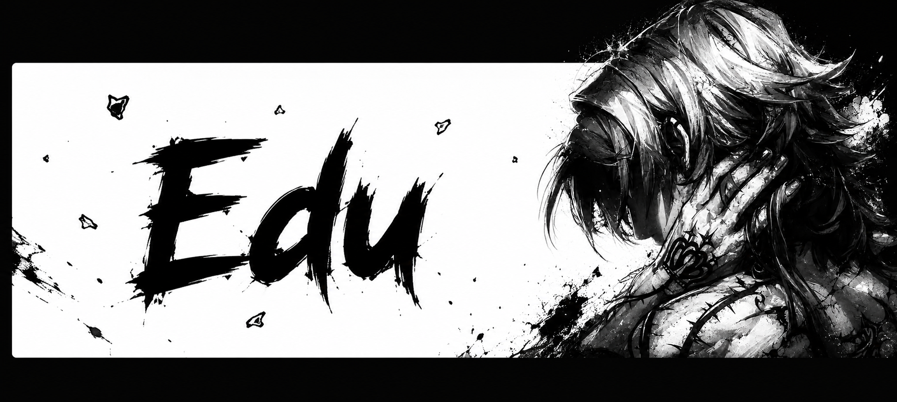

  

  
  
  

---

### About Me

**Ei, tudo certo? Prazer Sou o Edu!**

Sou desenvolvedor Full Stack Jr., formado em Técnico em Informática para Internet pelo IFRN. Desenvolvo projetos próprios usando React, Next.js, Django e Django REST Framework.

Gosto de transformar ideias em produtos reais, sempre buscando evoluir por meio de projetos práticos, boas práticas de desenvolvimento e aprendizado contínuo.

Atualmente em busca da minha primeira oportunidade profissional como Desenvolvedor de Software.

---

### Projects

 

 <b><a href="https://calangos-marketing.vercel.app/" style="color: inherit; text-decoration: none;">CALANGOS MARKETING</a></b> — Site institucional, para a Calangos Marketing. (Stack: React, Vite, Tailwind CSS, GSAP)

 <b><a href="#" style="color: inherit; text-decoration: none;">SEORGANIZE</a></b> — Sistema de gestão de tarefas, ciclo completo . (Stack: React, Django REST Framework, JWT)

 

---

### Connect

  
  
  

> "E de repente, num dia qualquer, acordamos e percebemos que já podemos lidar com aquilo que julgávamos maior que nós mesmos. Não foram os abismos que diminuíram, mas nós que crescemos."
>
> — Fabíola Simões

---

### Contribution

  
  

